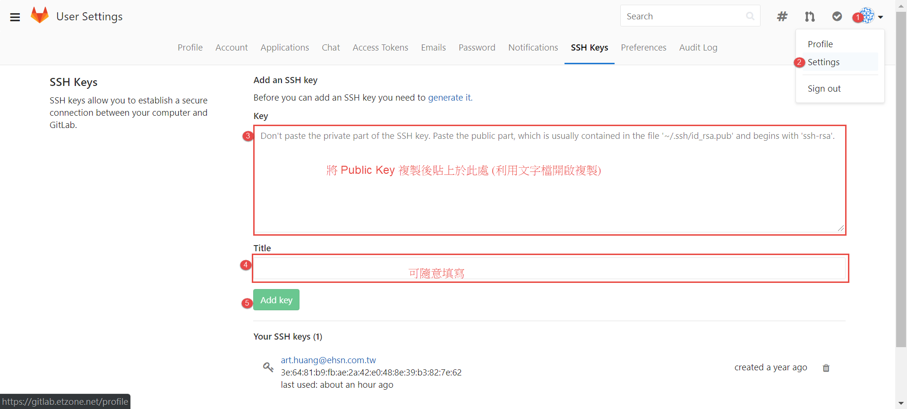
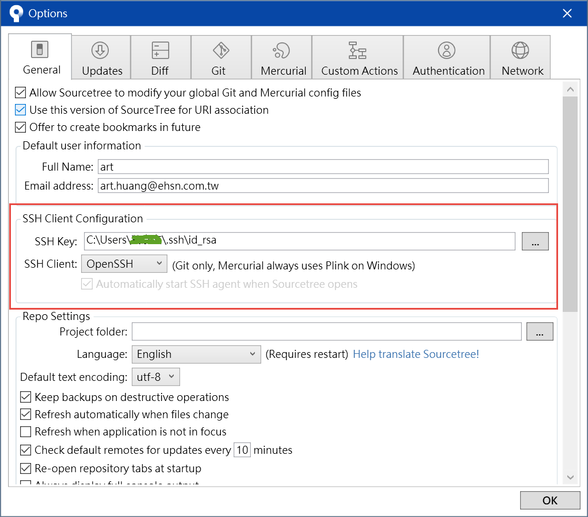
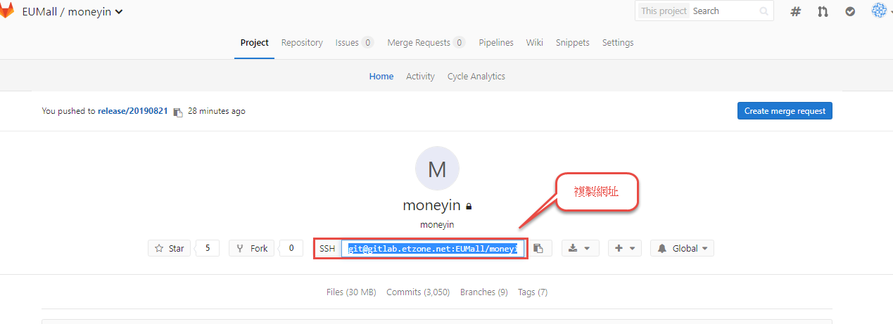
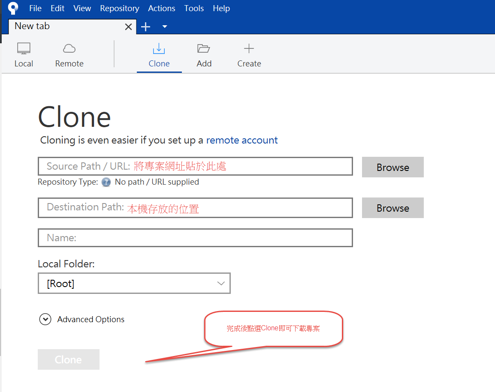
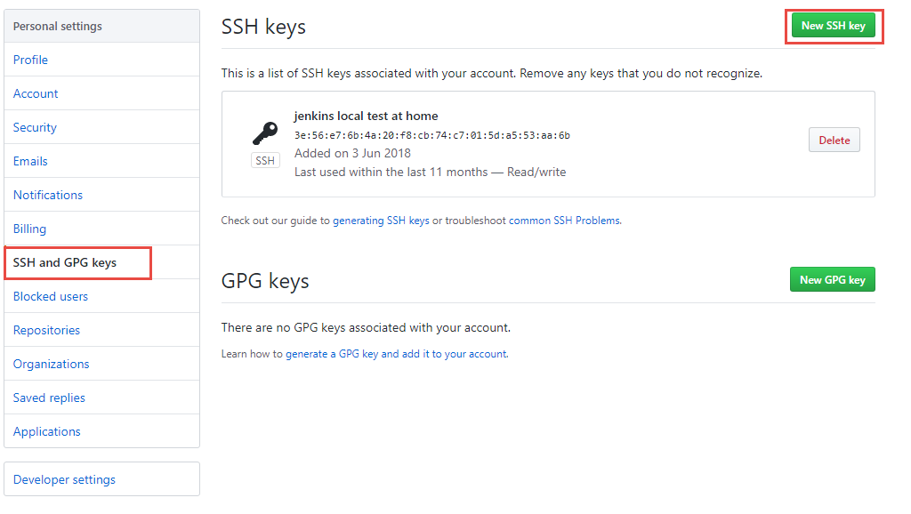
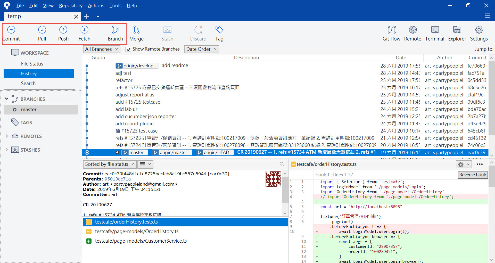

# 安裝 Git

在 Windows 環境安裝請參考[這篇文章](https://gitbook.tw/chapters/environment/install-git-in-windows.html)進行

# 安裝 SourceTree

安裝過程中會需要提供 Atlassian 的帳號，需要先註冊會員，可參考[這篇文章](https://dotblogs.com.tw/jamesfu/2016/05/09/sourcetree)進行安裝

至[官網](https://www.sourcetreeapp.com/)下載[軟體](https://product-downloads.atlassian.com/software/sourcetree/windows/ga/SourceTreeSetup-3.1.3.exe?_ga=2.157333437.689675787.1566374421-1841491227.1566374421)
依照畫面指示進行安裝，安裝過程會詢問遠端 Git 的主機、是否要用 SSH 等等其他的問題，這邊一律都先略過

# SSH + GitLab + SourceTree

進行 SSH、GitLab、SourceTree 的設定

## 設定 Git 使用者資訊

```bash
> git config --global user.name "test"
> git config --global user.email "test@gmail.com"
```

## 利用 Git Bash 產生 SSH key

Windows 預設位置為 `%userprofile%\.ssh`，如果沒有產生過的話是沒有資料夾的，如果有的話，可以先備份再刪除。產生金鑰的語法如下，過程會詢問問題，直接按 Enter 略過即可

```
ssh-keygen -t rsa -C "test@gmail.com"
```

ssh key 預設的檔案名稱

1. publicky key：`id_rsa.pub` (用來設定 GitLab)
1. private key：`id_rsa` (用來設定 SourceTree)

## 設定 GitLab

登入 GitLab 進入設定頁面，選擇 SSH Keys 頁籤，將 public key 貼上儲存即可


## 設定 SourceTree

開啟 SourceTree，`Tools`->`Options`進入設定頁面，將 SSH private key 的路徑填入即可



# 如何取得遠端程式碼

開啟 GitLab 專案頁面，應該會看到專案網址，將其複製下來


接著再開啟 SourceTree，如下圖，選擇 Clone 遠端專案


輸入專案網址、存放本機路徑、專案名稱，就可以點`Clone`按鈕下載專案

# 在 GitHub 設定

因為先前在 GitLab 設定過 SSH，所以可以不需要輸入帳密即可操作，同樣原理，若來源是 GitHub 也是一樣的步驟，都是在網站設定好 SSH public key，在本機 Git Client 端(SourceTree)設定好 SSH private key 即可


> 貼上public key的時候，請從`ssh-rsa`開頭複製到檔案結束


# 如何更新本機專案

選擇專案頁籤後，可看見上方的 ICON，如下圖


紅色框住的部分是較常用的功能

## Commit

本機程式碼修改後可點擊此處進入 Commit 作業，可選擇某些檔案簽入，或者是全部簽入，同時需要為 Commit 寫個標題，相關的指令為

```
// 加入所有檔案
git add .
// 將暫存的檔案Commit
git commit -m "這是 Commit 標題"
```

## Pull

將遠端程式碼下載回本機，通常在執行這項作業的時候必須要先確保本機沒有任何開發中(未經過 Commit)的程式碼，如果有的話 Git 會嘗試自動合併，若有衝突則需要人工介入處理，相關的指令為

```
// 拉取遠端程式
git pull
```

## Push

將本機程式碼推上遠端，同樣也必須確保本機與遠端的程式基準點是相同的，如果遠端比較新，本機版本比較舊，就無法推上去，必須要先下載、合併，然後才能推上去，相關的指令為

```
// 推送程式碼
git push
```

## Fetch

通常會用這個按鈕是為了取得遠端分支的現況，以及各個 Commit 是否有需要更新，關於 `git pull`、`git fetch`的介紹，建議可參考[此篇文章](https://gitbook.tw/chapters/github/pull-from-github.html)
